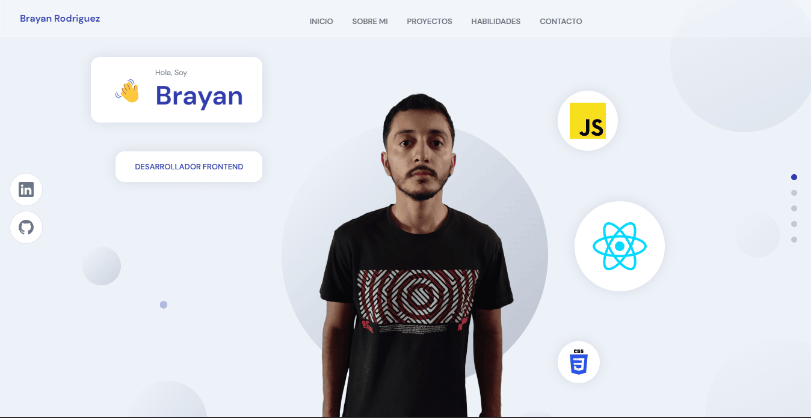

# Portfolio

## Screenshot


My personal website.

### Built With
* 
* 
* 
* Sanity
* Framer Motion

## Installation
Clone project 
```
  git clone https://github.com/Brayanro/portfolio-v2.git
```

Install dependencies
```
  yarn install or npm install
```

Run proyect in development
```
  yarn dev or npm run dev
```

## Contact
(mailto:brayan7890123@gmail.com)